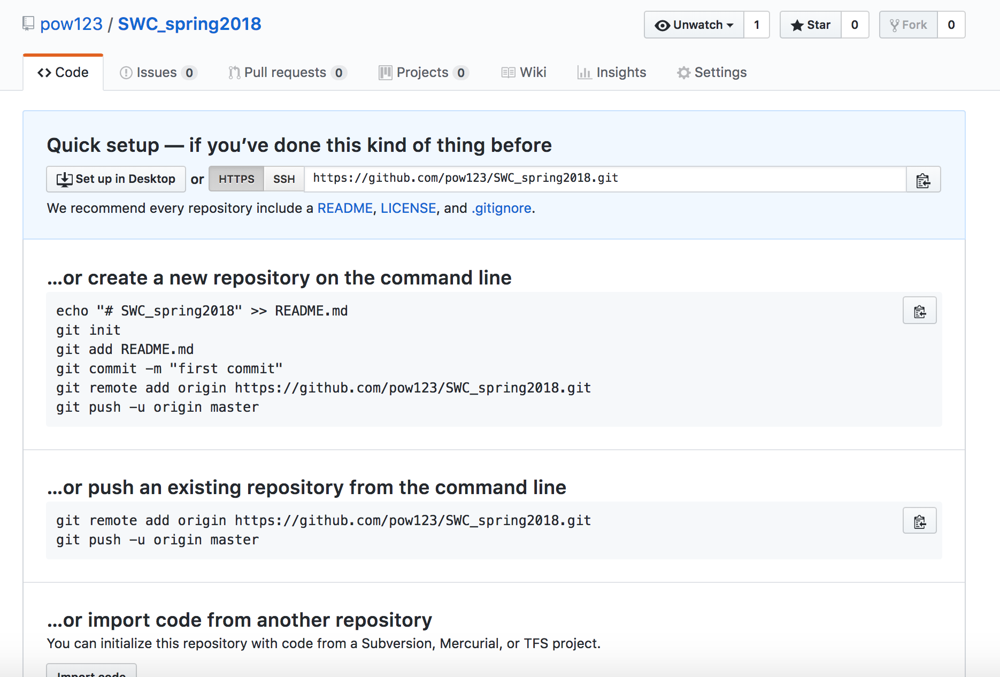

So far, our work was restricted to the local machine. But if you want to share your repositories with your colleagues, it would be nice to have a central place where everyone could make their repositories available for comments, suggestions, and collaboration. GitHub is a service that allows us to do that. 

If you have not created GitHub account, please go to [github.com](https://github.com) and do it now. 

Now we want to create repository that will be a remote copy of our local `SWC_spring2018` repository. 
```
#From your GitHub account:
Click on 'new repository'
Repository name: 'SWC_spring2018'
Type: public
Click on 'create repository'
```
You have just created remote empty `SWC_spring2018` repository. This repository has a specific identifier URL associated with it.  As soon as the repository is created, GitHub displays a page with that URL and some
information on how to configure your local repository:



This effectively does the following on GitHub's servers:

~~~
$ mkdir SWC_spring2018
$ cd SWC_spring2018
$ git init
~~~
{: .bash}

Our local repository still contains our earlier work, but the
remote repository on GitHub doesn't contain any files yet. 

> ## HTTPS vs. SSH
>
> We use HTTPS here because it does not require additional configuration.  After
> the workshop you may want to set up SSH access, which is a bit more secure, by
> following one of the great tutorials from
> [GitHub](https://help.github.com/articles/generating-ssh-keys),
> [Atlassian/BitBucket](https://confluence.atlassian.com/display/BITBUCKET/Set+up+SSH+for+Git)
> and [GitLab](https://about.gitlab.com/2014/03/04/add-ssh-key-screencast/)
> (this one has a screencast).
{: .callout}

We now let our local machine know that we have a remote location for our local repository.
```
#on your local machine
$ git remote add origin URL
```
The name origin is a local nickname for your remote repository. We could use something else if we wanted to, but origin is by far the most common choice.

Once the nickname origin is set up, this command will push the changes from our local repository to the repository on GitHub:
```
$ git push -u origin master
```
This is it! You just made your local `SWC_spring2018` repository available on GitHub for everyone to access. You are now in position to share your work and collaborate with others. How cool is this?

> ## Optional Activity
> Suppose you want to add another file to your repository. 
> Download command history file for the Python lesson this morning and 
> add it to your local directory and then push it to Github.
> 
> <https://hackmd.io/IwQwrCAMCmDGAcBaSB2eAjRAWAbAZgCZEQRhpFgth4cAzKgEwIeiA===?both>
> {: .challenge}
